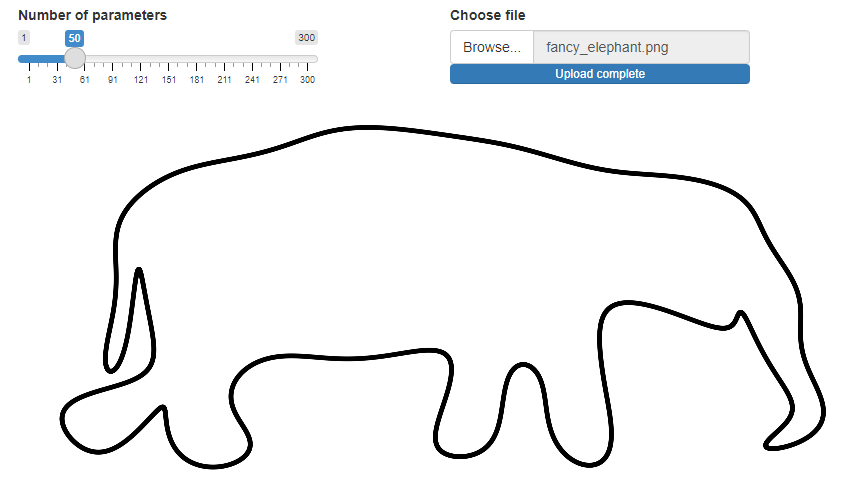

# Fitting an Elephant

"With four parameters I can fit an elephant, and with five I can make him wiggle his trunk." - John von Neumann

This repository contains a small R Shiny app that lets you interactively fit an elephant with a variable number of parameters, using a Fourier transform.

## Getting Started

To run this application, download Posit (formerly RStudio), open global.R, install the required packages and press "Run App" on the top-right.

You can also run this on other images by specifying their path in global.R. However, the fit is always a single line. So this works best for images that can be "drawn in a single line" and with clear contrast.

## Mathematical Details

The `fourier` function server.R applies Fourier transform techniques to a reconstruct an image based on a vector of complex numbers that represent this image.

### Discrete Fourier Transform (DFT)

The DFT of a sequence of $N$ complex numbers $v[m]$ is given by:

$$Z(k) = \sum_{m=1}^{N} v[m] \cdot e^{-i2\pi \frac{mk}{N}}$$

where $Z(k)$ is the DFT output at frequency $k$ and $v[m]$ is the $m$-th complex sample.

### Inverse Discrete Fourier Transform (IDFT)

The reconstructed signal from its frequency-domain representation is computed as:

$$v(t) = \frac{1}{M} \sum_{k=1-M/2}^{M-M/2} Z(k) \cdot e^{i2\pi \frac{tk}{N}}$$

where $M$ is the precision parameter, controlling the subset of frequencies used, and $N$ is specified by `NUMBER_POINTS_TO_FIT`.

## Credits

The image fancy_elephant.png is taken from https://github.com/983/Elephant.
